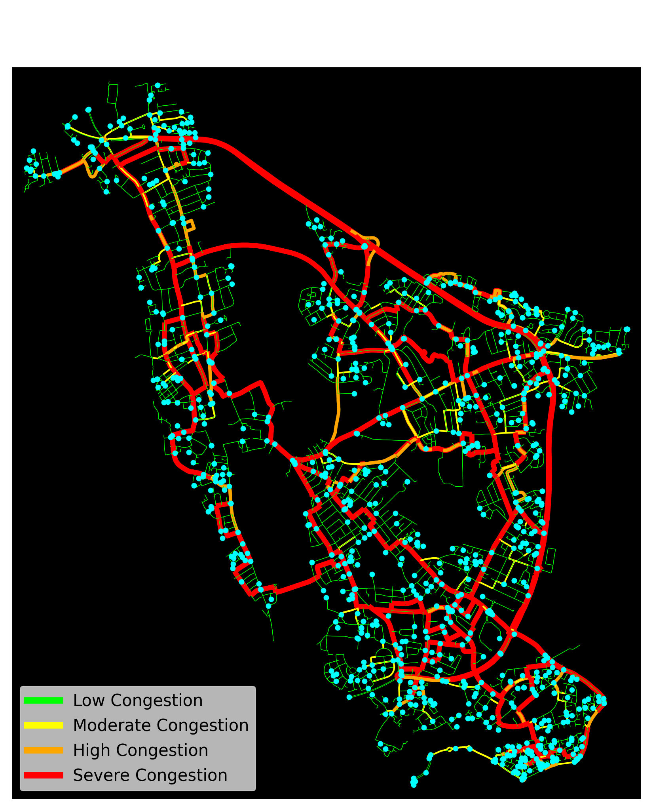
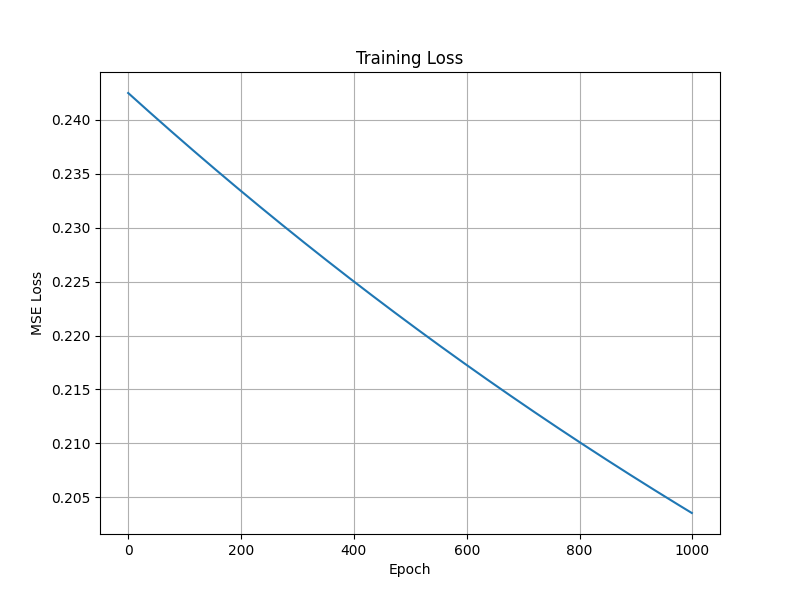

# Adaptive Traffic Routing and Congestion Optimisation

A congestion-aware traffic routing and simulation system combining classical graph-search algorithms, dynamic congestion weighting, and custom feed-forward neural networks for adaptive transportation optimisation.

The project models real-world urban road networks using OpenStreetMap data and evaluates how dynamic rerouting strategies influence congestion distribution across weighted transportation graphs.

## Research Motivation 

Traffic congestion is an ongoing issue across the world, particularly within major urban environments such as London and Manchester where population density is significantly higher. Congestion negatively impacts both transportation efficiency and the general quality of travel for commuters attempting to move between destinations without unnecessary delay.

Traffic congestion occurs when the number of vehicles using a road exceeds the capacity that the road network can efficiently handle, resulting in increased delays, slower travel speeds, and higher levels of inconvenience for road users.

With increased travel times, congestion also introduces financial costs due to greater fuel consumption, prolonged idle periods, and inefficient re-routing behaviour. These effects become increasingly significant as urban populations continue to grow and transportation infrastructure becomes more heavily utilised.

This dissertation investigates adaptive approaches for traffic routing and congestion mitigation using both classical pathfinding algorithms and artificial intelligence techniques. Classical shortest-path approaches such as Dijkstra's algorithm and A* are explored as foundational routing methods. These approaches are then extended using dynamic congestion modelling and a custom feed-forward neural network capable of adapting to surrounding traffic conditions.

## Features

- Real-world road network extraction using OSMnx
- Weighted graph-based transportation modelling
- Dijkstra and A* pathfinding comparison
- Dynamic congestion-aware rerouting
- Congestion heat-map visualisation
- Feed-forward neural network implemented from first principles
- Runtime and routing-performance evaluation
- Adaptive travel-time weighting system

## System Visualisations

### Congestion Heat-map


### Neural Network Training Loss


## System Architecture

The system follows the pipeline:

1. Generate weighted transportation graph from OpenStreetMap
2. Simulate vehicles across valid graph nodes
3. Calculate shortest-path routes using Dijkstra or A*
4. Measure edge utilisation and congestion severity
5. Apply adaptive congestion weighting
6. Dynamically reroute vehicles
7. Train neural network on congestion features
8. Evaluate routing and prediction performance
  
## Experimental Evaluation

The system was evaluated across traffic densities ranging from 10 to 1000 simulated vehicles.

Metrics included:
- Runtime complexity
- Average edge utilisation
- Maximum bottleneck severity
- Average travel cost
- Mean Squared Error (MSE)
- Root Mean Squared Error (RMSE)
- Mean Absolute Error (MAE)

## Key Findings

- A* reduced unnecessary graph traversal compared to Dijkstra
- Dynamic congestion weighting redistributed traffic flow
- Bottlenecks persisted on high-connectivity arterial roads
- The neural network successfully learned general congestion relationships
- Dataset imbalance reduced prediction accuracy for severe congestion states

## Project Structure

```text
Neural-Traffic-Routing-and-Congestion-Optimisation-System/
│
├── README.md
├── requirements.txt
│
├── research/
│   ├── experiments.md
│   ├── ideas.md
│   └── research_log.md
│
├── src/
│   │
│   ├── artificial_intelligence/
│   │   ├── congestion_model.py
│   │   ├── inference.py
│   │   ├── neural_network.py
│   │   ├── train_model.py
│   │   └── training_data.csv
│   │
│   ├── images/
│   │   ├── heatmap.png
│   │   └── training_loss.png
│   │
│   └── main_program/
│       ├── averaged_results.csv
│       ├── generate_evaluation_graphs.py
│       ├── graph.py
│       ├── main.py
│       ├── metrics.py
│       ├── results.csv
│       ├── simulation.py
│       ├── vehicle.py
│       ├── visualisation.py
│       │
│       ├── W1.npy
│       ├── W2.npy
│       ├── W3.npy
│       ├── b1.npy
│       ├── b2.npy
│       └── b3.npy
│
└── tests/
```

## Installation and Requirements
pip install -r requirements.txt
