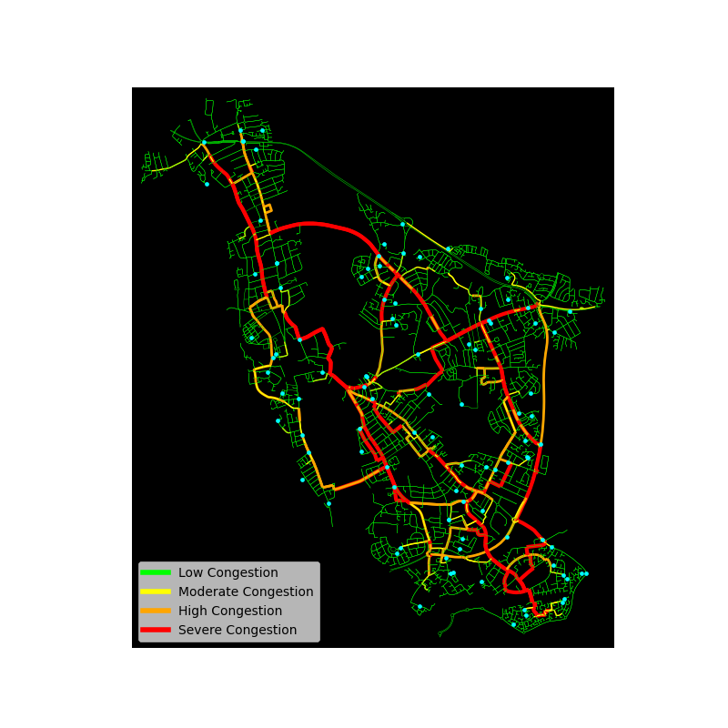
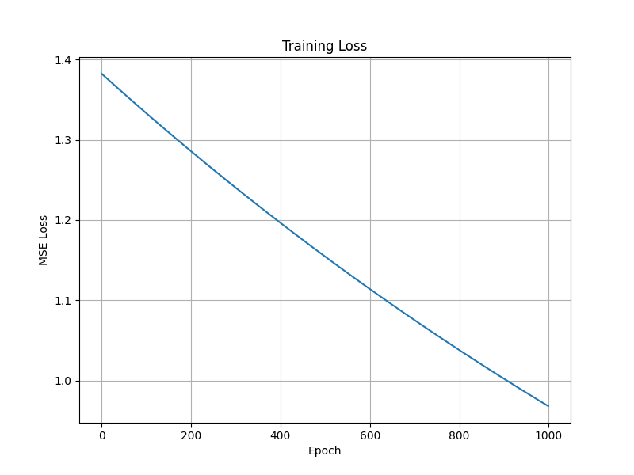

# Adaptive Traffic Routing and Congestion Optimisation

A congestion-aware traffic routing and simulation system combining classical graph-search algorithms, dynamic congestion weighting, and custom feed-forward neural networks for adaptive transportation optimisation.

The project models real-world urban road networks using OpenStreetMap data and evaluates how dynamic rerouting strategies influence congestion distribution across weighted transportation graphs.

## Features

- Real-world road network extraction using OSMnx
- Weighted graph-based transportation modelling
- Dijkstra and A* pathfinding comparison
- Dynamic congestion-aware rerouting
- Congestion heat-map visualisation
- Feed-forward neural network implemented from first principles
- Runtime and routing-performance evaluation
- Adaptive travel-time weighting system

## System Visualisations

### Congestion Heat-map

### Neural Network Training Loss

## System Architecture

The system follows the pipeline:

1. Generate weighted transportation graph from OpenStreetMap
2. Simulate vehicles across valid graph nodes
3. Calculate shortest-path routes using Dijkstra or A*
4. Measure edge utilisation and congestion severity
5. Apply adaptive congestion weighting
6. Dynamically reroute vehicles
7. Train neural network on congestion features
8. Evaluate routing and prediction performance
  
## Experimental Evaluation

The system was evaluated across traffic densities ranging from 10 to 1000 simulated vehicles.

Metrics included:
- Runtime complexity
- Average edge utilisation
- Maximum bottleneck severity
- Average travel cost
- Mean Squared Error (MSE)
- Root Mean Squared Error (RMSE)
- Mean Absolute Error (MAE)

## Key Findings

- A* reduced unnecessary graph traversal compared to Dijkstra
- Dynamic congestion weighting redistributed traffic flow
- Bottlenecks persisted on high-connectivity arterial roads
- The neural network successfully learned general congestion relationships
- Dataset imbalance reduced prediction accuracy for severe congestion states

## Installation and Requirements
pip install -r requirements.txt
